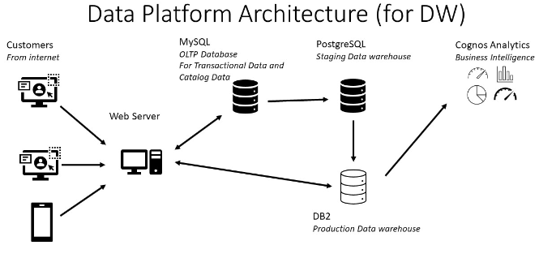

# BI-and-Data-Warehousing-Solution-for-E-commerce
## Table of Contents
1. [Summary](#summary)
2. [Key tasks](key-tasks)
3. [Architecture](#architecture)
4. [Tools](#tools)
5. [Database Design](#database-design)
6. [Installation](#installation)
   - [Prerequisites](#prerequisites)
   - [Setup Steps](#setup-steps)
7. [Usage](#usage)
8. [Contributing](#contributing)
9. [License](#license)
10. [Contact Information](#contact-information)

## Summary
The BI-and-Data-Warehousing-Solution-for-E-commerce 
is a project inspired by the [Course 9](https://github.com/Starias22/IBM-Data-Warehouse-Engineer-Professional-Certificate/blob/main/Course9/notes.md) of
the [IBM Data Warehouse Engineer Professional Certificate](https://github.com/Starias22/IBM-Data-Warehouse-Engineer-Professional-Certificate/), titled Data Warehousing Capstone Project. It consists to build a data platform for retails analytics.

## Process Description
SoftCart's online presence is primarily through its website, which customers access using a variety of devices like laptops, mobiles and tablets.

All the catalog data of the products and transactional data like inventory and sales are stored in the MySQL database server.

SoftCart's webserver is driven entirely by this database.

Data is periodically extracted from this database and put into the staging data warehouse running on PostgreSQL.

Production data warehouse is on the cloud instance of IBM DB2 server.

BI teams connect to the IBM DB2 for operational dashboard creation. IBM Cognos Analytics is used to create dashboards.

An ETL process using a shell script is set up to extract new transactional data for each day from the OLTP database and load it into the staging data warehouse.

## Architecture

Here is the architecture of the data platform

## Tools
- MySQL: OLTP database
- phpMyAdmin 
- PostgreSQL: Staging - Data warehouse
- IBM Db2 on Cloud: Production Data warehouse
- IBM Cognos Analytics: Business Intelligence Dashbording tool
- Bash
- Cron
- PgModeler

## Key Tasks

Here are key tasks with a short description. For more details informations and the codes to perform each of them, refers to the links bellow corrsponding to each task.

### [Task 1](./tasks/task1.md): Set up a transactional database:
- Design the OLTP database
- Populate the OLTP database with the provided data
- Create an index to accelerate data retrieval
- Create a data backup script

Here is the schema of the `sales_data` table in the `sales` database

| Field        | Description                             |
|--------------|-----------------------------------------|
| product_id   | The ID of the product (Primary key)      |
| customer_id  | The ID of the customer (Foreign key)     |
| price        | The price of the product   |
| quantity     | The quantity of products sold            |
| timestamp    | The timestamp of the transaction         |

### Task 2: Build the data warehouse:
- Design a schema for the data warehouse
- Create the schama and load the data into fact and dimension tables
- Automate the daily incremental data insertion into th data warehouse
- Create CUBES and ROLLUPS to make the reporting easier

### Task 3
- Create a BI dashboard:
- Create a barchart of quarterly sales of cell phones 
- Craete a piechart of sales of electronic goods by category
- Create a line chart of total sales per month for a given year

### Task 4
- create ETL Data Pipelines to feed the Data Warehouse on a regular basis with new data:
- Extract data from an OLTP database into CSV format
- Transform the OLTP data to suit the data warehouse schema
- Load the transformed data into the data warehouse
- Verify that the data is loaded properly.

