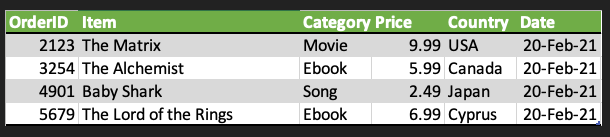
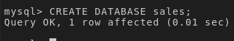
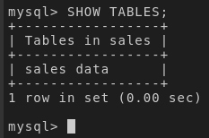

# Task 1: Set up a transactional database

## Design the OLTP database

### Schema of the `sales_data` table


From the sample data above we can deduce a schema for the `sales_data` table. 


| Field        | Description                             |
|--------------|-----------------------------------------|
| product_id   | The ID of the product (Primary key)      |
| customer_id  | The ID of the customer (Foreign key)     |
| price        | The price of the product   |
| quantity     | The quantity of products sold            |
| timestamp    | The timestamp of the transaction         |

### Create the `sales`database 

Get connected to MySQL CLI and create the `sales`database.

```sql
CREATE DATABASE sales;
```



### Create the `sales_data` table

Get connected to the database and create the `sales_data` table
```sql
USE sales;
CREATE TABLE sales_data (
    product_id INTEGER NOT NULL,
    customer_id INTEGER NOT NULL,
    price REAL NOT NULL,
    quantity INTEGER NOT NULL,
    timestamp TIMESTAMP NOT NULL
);
```


### Show tables

```sql
SHOW TABLES;
```




## Populate the OLTP database with the provided data

### Import data

- Download on your local computer the file `oltpdata.csv` from [here](https://cf-courses-data.s3.us.cloud-object-storage.appdomain.cloud/IBM-DB0321EN-SkillsNetwork/oltp/oltpdata.csv). It contains sales transactions.

    You can downlod the data either manually or using wget

```sh
wget https://cf-courses-data.s3.us.cloud-object-storage.appdomain.cloud/IBM-DB0321EN-SkillsNetwork/oltp/oltpdata.csv
```

- Go to phpMyAdmin, select the `sales` database and the `sales_data` table
- Import the data from `oltpdata.csv` into `sales_data` table.


### Check the data import
Go back to MySQL CLI, to the sales database and  run the following command to get the number of rows inserted into the table.

```sql
SELECT COUNT(*) FROM sales_data;
```


## Index
### Create and index

Create an index on the `timestamp` in the `sales_data` table
```sql
CREATE INDEX ts ON sales_data(timestamp);
```


### Check index creation

Check the index is created effectively created by listing the available indexes on the  `sales_data` table using the following command.

```sql
SHOW INDEXES FROM sales data;
```


## Backup

### Create the backup script
- Create a bash script file named datadump.sh
```
touch datadump.sh
```
- Write into the file a script to backup the `sales_data` of the database as a SQL file.
- You may customize the parameters(host, user, password) if needed
```sh
#!/bin/bash
mysqldump --host=172.21.68.113 --port=3306 --user=root \
--password=0E2CGaCGBfydvGa6kCiAZBWu sales sales_data > sales_data.sql

echo "Data exported successfully to sales_data.sql."
```
- Save the file

### Make the backup file executable for the curent usable

```sh
sudo chmod u+x datadump.sh
```

### Run the backup script

```sh
./datadump.sh
```

### Check the backup file

```sh
cat sales_data.sql
```


