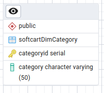
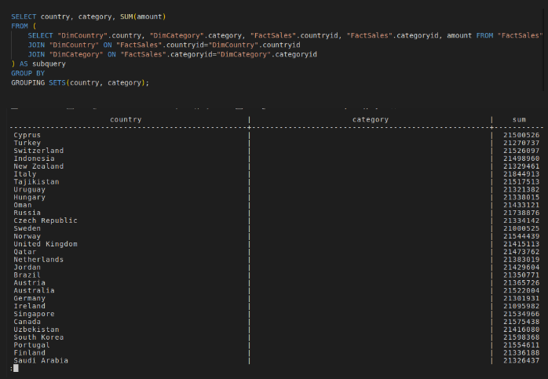
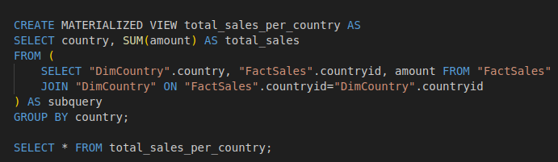

# Task 2: Build the data warehouse

## Data Warehouse Design and Setup

This consists to use the provided sample data to design a star schema for the data warehouse. Here is an overview of the sample data.

The design has been created using PgAdmin.


### 1. Design the dimension table softcartDimDate

| Field | Description |
|----------|----------|
| dateid   | The id of the date (Primary key) |
| date   | The date (20-Feb-21)  |
 weekday   | The day number in the week (from 1 to 7) |
| weekdayname  | The name of the day in the week (from Monday to Sunday)|
| month | The month number (from 1 to 12) |
| monthname | The name of the month (from January to December) |
| quarter   | The quarter number (1, 2, 3 or 4) |
| quartername   | The name of the quarter (Q1, Q2, Q3 or Q4) |
| year   | The year (2022, 2023 for examples) |


### 2. Design the dimension table softcartDimCategory

| Field | Description |
|----------|----------|
| categoryid   | The id of the category (Primary key) |
| category   | The category (Movie, Ebook, Song for examples) |



### 3. Design the dimension table softcartDimItem

| Field | Description |
|----------|----------|
| itemid   | The id of the item (Primary key) |
| item   | The item (The Matrix, The Alchemist, Baby Shark, THe Lord of the Rings for examples) |


### 4. Design the dimension table softcartDimCountry

| Field | Description |
|----------|----------|
| countryid   | The id of the country (Primary key) |
| country  | The name of the country (USA, Canada, Japan, Cyprus for examples) |


### 5. Design the fact table softcartFactSales

| Field | Description |
|----------|----------|
| orderid   | The order id (Primary key) |
| price  | The quantity of waste colleted in tons (9.99, 5.99, 2.49, 6.99 for examples)  |
|dateid   | The  date id (foreign key) |
|categoryid   | The id of the category (Foreign key) |
| itemid   | The id of the item (Foreign key) |
| countryid   | The id of the country (Foreign key) |


### 6. Design the relationships


### 7. Create the schema


## Data Warehouse Reporting

### Loading Data

#### 1. Load data into the dimension table `DimDate`

- Download the data either [manually](https://cf-courses-data.s3.us.cloud-object-storage.appdomain.cloud/IBM-DB0321EN-SkillsNetwork/datawarehousing/data/DimDate.csv) or using wget.

```sh
wget https://cf-courses-data.s3.us.cloud-object-storage.appdomain.cloud/IBM-DB0321EN-SkillsNetwork/datawarehousing/data/DimDate.csv
```

- Load the data

```sql
\COPY "DimDate"
FROM 'DimDate.csv' 
DELIMITER ',' CSV HEADER;
```

- List the first five (5) rows of the table `DimDate`

```sql
SELECT * FROM "DimDate" LIMIT 5;
```


#### 2. Load data into the dimension table `DimCategory`

- Download the data either [manually](https://cf-courses-data.s3.us.cloud-object-storage.appdomain.cloud/IBM-DB0321EN-SkillsNetwork/datawarehousing/DimCategory.csv) or using wget

```sh
wget https://cf-courses-data.s3.us.cloud-object-storage.appdomain.cloud/IBM-DB0321EN-SkillsNetwork/datawarehousing/DimCategory.csv
```

- Load the data

```sql
\COPY "DimCategory"
FROM 'DimCategory.csv'
DELIMITER ',' CSV HEADER;
```

- List the first five (5) rows of the table `DimCategory`


#### 3. Load data into the dimension table `DimCountry`

- Download the data either [manually](https://cf-courses-data.s3.us.cloud-object-storage.appdomain.cloud/IBM-DB0321EN-SkillsNetwork/datawarehousing/DimCountry.csv) or using wget

```sh
wget https://cf-courses-data.s3.us.cloud-object-storage.appdomain.cloud/IBM-DB0321EN-SkillsNetwork/datawarehousing/DimCountry.csv
```

- Load the data

```sql
\COPY "DimCountry"
FROM 'DimCountry.csv'
DELIMITER ',' CSV HEADER;
```

- List the first five (5) rows of the table `DimCountry`

```sql
SELECT * FROM "DimCountry" LIMIT 5;
```


#### 4. Load data into the fact table `FactSales`

- Download the data either [manually](https://cf-courses-data.s3.us.cloud-object-storage.appdomain.cloud/IBM-DB0321EN-SkillsNetwork/datawarehousing/FactSales.csv) or using wget

```sh
wget https://cf-courses-data.s3.us.cloud-object-storage.appdomain.cloud/IBM-DB0321EN-SkillsNetwork/datawarehousing/FactSales.csv
```

- Load the data


```sql
\COPY "FactSales"
FROM 'FactSales.csv'
DELIMITER ',' CSV HEADER;
```

- List the first five (5) rows of the table `FactSales`

```sql
SELECT * FROM "FactSales" LIMIT 5;
```


### Queries for data analytics

#### 1. Create a GROUPING SETS Query

Create a grouping sets query using the columns country, category, totalsales.

```sql
SELECT country, category, SUM(amount)
FROM (
    SELECT "DimCountry".country, "DimCategory".category, "FactSales".countryid, "FactSales".categoryid, amount FROM "FactSales"
    JOIN "DimCountry" ON "FactSales".countryid="DimCountry".countryid
    JOIN "DimCategory" ON "FactSales".categoryid="DimCategory".categoryid
) AS subquery
GROUP BY
GROUPING SETS(country, category);
```



#### 2. Create a ROLLUP Query

Create a rollup query using the columns year, country, and totalsales.

```sql
SELECT year, country, SUM(amount)
FROM (
    SELECT "DimDate".year, "DimCountry".country, "FactSales".dateid, "FactSales".countryid, amount FROM "FactSales"
    JOIN "DimDate" ON "FactSales".dateid="DimDate".dateid
    JOIN "DimCountry" ON "FactSales".countryid="DimCountry".countryid
) AS subquery
GROUP BY
ROLLUP(year, country);
```


#### 3. Create a CUBE Query

Create a cube query using the columns year, country, and average sales.

```sql
SELECT year, country, AVG(amount)
FROM (
    SELECT "DimDate".year, "DimCountry".country, "FactSales".dateid, "FactSales".countryid, amount FROM "FactSales"
    JOIN "DimDate" ON "FactSales".dateid="DimDate".dateid
    JOIN "DimCountry" ON "FactSales".countryid="DimCountry".countryid
) AS subquery
GROUP BY
CUBE(year, country);
```


#### 4. Create an MQT

Create an MQT named total_sales_per_country that has the columns country and total_sales.

```sql
CREATE MATERIALIZED VIEW total_sales_per_country AS 
SELECT country, SUM(amount) AS total_sales
FROM (
    SELECT "DimCountry".country, "FactSales".countryid, amount FROM "FactSales"
    JOIN "DimCountry" ON "FactSales".countryid="DimCountry".countryid
) AS subquery
GROUP BY country;

SELECT * FROM total_sales_per_country;
```


