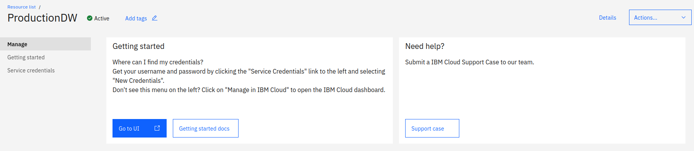
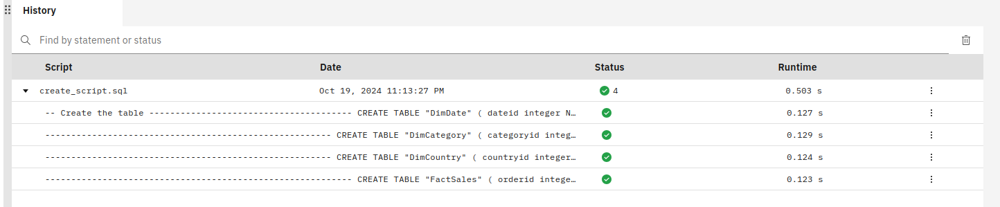
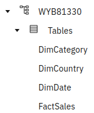
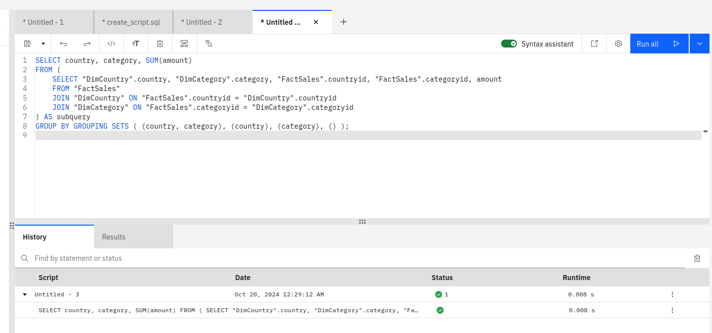
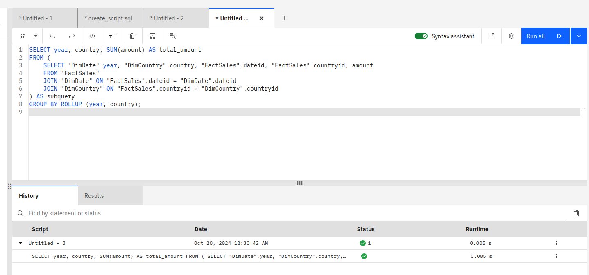
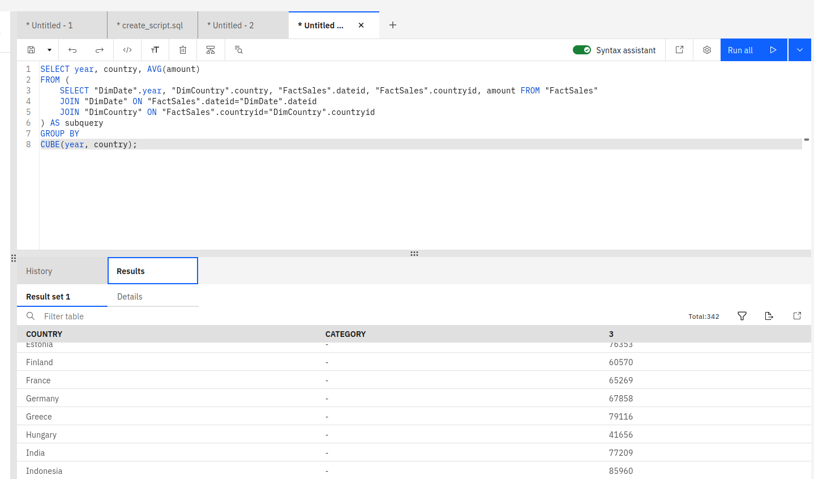

# Data Warehouse Reporting using IBM Db2

## Create an IBM Db2 instance

- Go to [ibmcloud]() to create an instance of IBM Db2 using the Lite plan. You can do it by following this tutorial.
- Name the instance ProductionDW, which means Production Data Warehouse.
- During the creation of the instance, choose Dallas (us-south) as the location of your instance.

- Select the instance you've just created to lunch it. You will have something like the following.



## Create Credentials for the IBM Db2 instance

To create credentials for your instance, select Service credential-> New credential -> Add

## Create the schama

Download the SQL script for creating the schema of the production data warehouse. The SQL script can be found here [](./../../resources/create_tables.sql)

Select Manage-> Go to UI
Click on RUN SQL

Click on the Plus button, with the label Add new script

Choose FROM file

Select the tables creation script you/ve just downloaded.

Click RUN all

You will get an output looking like the following.



Click on Reload icon, with label Reload objects
Then select the schama and then Tables and you'll see that the four tables have been created within a schema (WYB81330 in my case)



## Loading Data

To load initial data into the data warehouse, we will use ibm_db, a python DB API to interact with DB2 on Cloud

### Set up a virtual environment

### Copy credentials

### Create the python script to load the data into the production data warehouse

and check


## Queries for data analytics

### 1. Create a GROUPING SETS Query

Create a grouping sets query using the columns country, category, totalsales.

```sql
SELECT country, category, SUM(amount)
FROM (
    SELECT "DimCountry".country, "DimCategory".category, "FactSales".countryid, "FactSales".categoryid, amount FROM "FactSales"
    JOIN "DimCountry" ON "FactSales".countryid="DimCountry".countryid
    JOIN "DimCategory" ON "FactSales".categoryid="DimCategory".categoryid
) AS subquery
GROUP BY
GROUPING SETS(country, category);
```



### 2. Create a ROLLUP Query

Create a rollup query using the columns year, country, and totalsales.

```sql
SELECT year, country, SUM(amount)
FROM (
    SELECT "DimDate".year, "DimCountry".country, "FactSales".dateid, "FactSales".countryid, amount FROM "FactSales"
    JOIN "DimDate" ON "FactSales".dateid="DimDate".dateid
    JOIN "DimCountry" ON "FactSales".countryid="DimCountry".countryid
) AS subquery
GROUP BY
ROLLUP(year, country);

```



### 3. Create a CUBE Query

Create a cube query using the columns year, country, and average sales.

```sql
SELECT year, country, AVG(amount)
FROM (
    SELECT "DimDate".year, "DimCountry".country, "FactSales".dateid, "FactSales".countryid, amount FROM "FactSales"
    JOIN "DimDate" ON "FactSales".dateid="DimDate".dateid
    JOIN "DimCountry" ON "FactSales".countryid="DimCountry".countryid
) AS subquery
GROUP BY
CUBE(year, country);
```




### 4. Create an MQT

Create an MQT named total_sales_per_country that has the columns country and total_sales.

```sql
CREATE MATERIALIZED VIEW total_sales_per_country AS 
SELECT country, SUM(amount) AS total_sales
FROM (
    SELECT "DimCountry".country, "FactSales".countryid, "FactSales".amount 
    FROM "FactSales"
    JOIN "DimCountry" ON "FactSales".countryid = "DimCountry".countryid
) AS subquery
GROUP BY country;

-- To select from the materialized view
SELECT * FROM total_sales_per_country;
```
