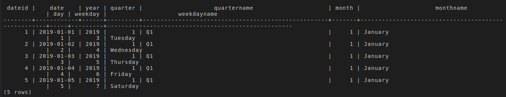
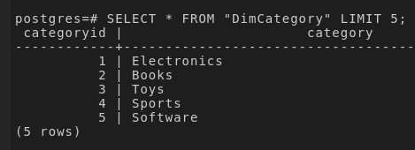
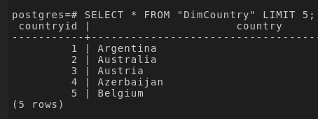
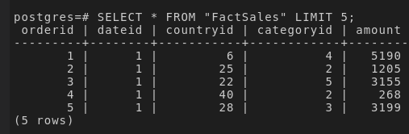
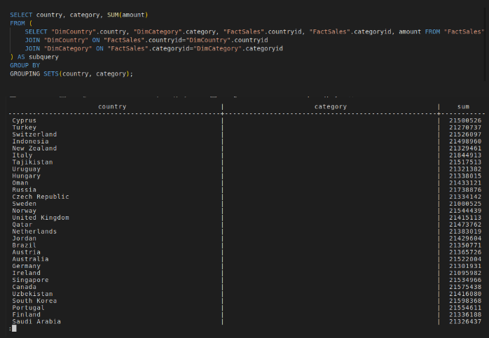
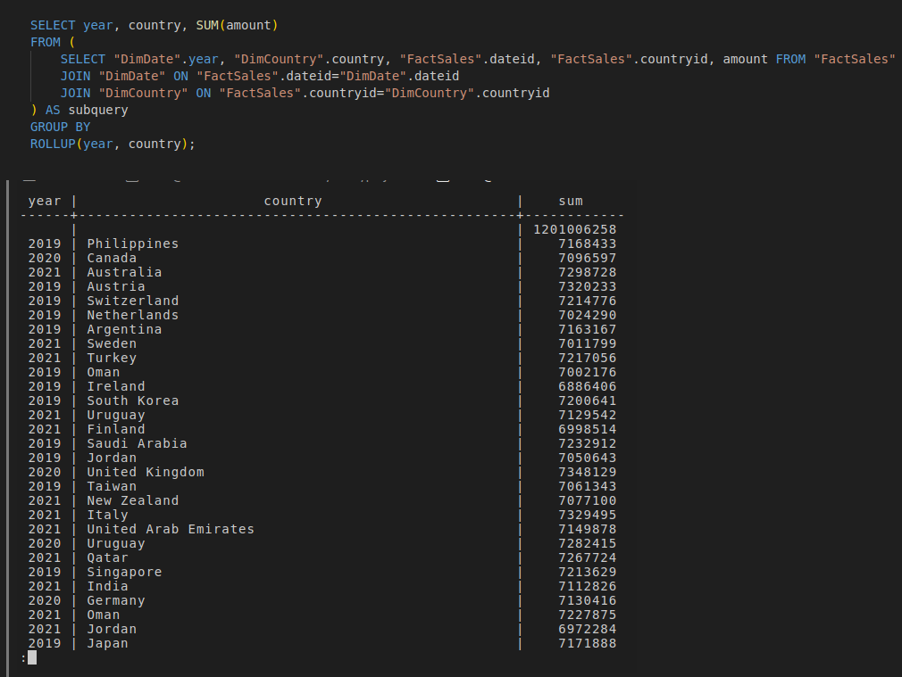
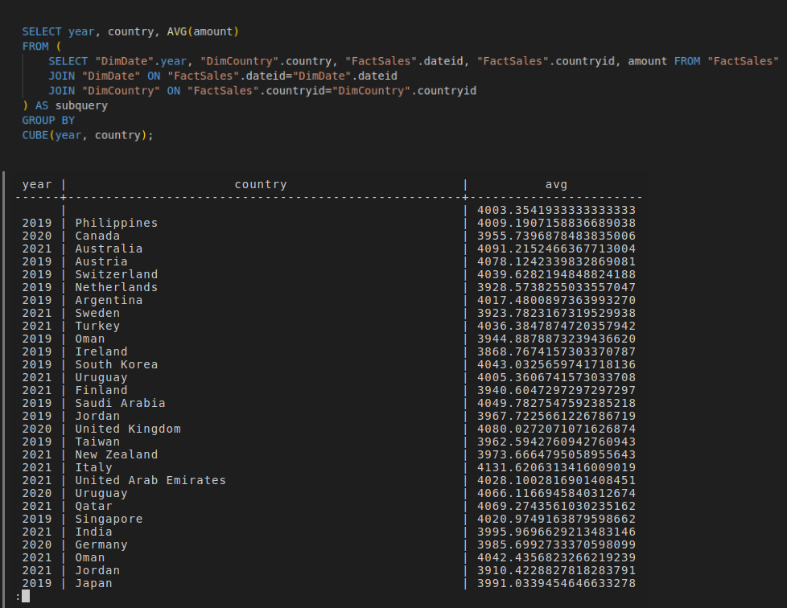
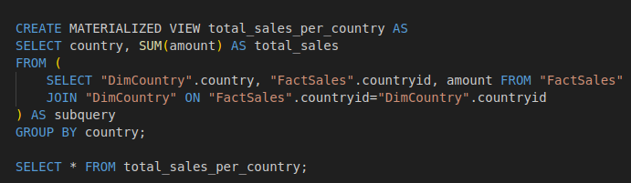

# Data Warehouse Reporting using PostgreSQL

- First of all download this script either [manually](https://cf-courses-data.s3.us.cloud-object-storage.appdomain.cloud/nm75oOK5n7AGME1F7_OIQg/CREATE-SCRIPT.sql) or using wget.

```sh
wget https://cf-courses-data.s3.us.cloud-object-storage.appdomain.cloud/nm75oOK5n7AGME1F7_OIQg/CREATE-SCRIPT.sql
```

- Run th script to get the dimension tables and the fact table created.

```sql
\include CREATE-SCRIPT.sql 
```

## Loading Data

### 1. Load data into the dimension table `DimDate`

- Download the data either [manually](https://cf-courses-data.s3.us.cloud-object-storage.appdomain.cloud/IBM-DB0321EN-SkillsNetwork/datawarehousing/data/DimDate.csv) or using wget.

```sh
wget https://cf-courses-data.s3.us.cloud-object-storage.appdomain.cloud/IBM-DB0321EN-SkillsNetwork/datawarehousing/data/DimDate.csv
```

- Load the data

```sql
\COPY "DimDate"
FROM 'DimDate.csv' 
DELIMITER ',' CSV HEADER;
```

- List the first five (5) rows of the table `DimDate`

```sql
SELECT * FROM "DimDate" LIMIT 5;
```



### 2. Load data into the dimension table `DimCategory`

- Download the data either [manually](https://cf-courses-data.s3.us.cloud-object-storage.appdomain.cloud/IBM-DB0321EN-SkillsNetwork/datawarehousing/DimCategory.csv) or using wget

```sh
wget https://cf-courses-data.s3.us.cloud-object-storage.appdomain.cloud/IBM-DB0321EN-SkillsNetwork/datawarehousing/DimCategory.csv
```

- Load the data

```sql
\COPY "DimCategory"
FROM 'DimCategory.csv'
DELIMITER ',' CSV HEADER;
```

- List the first five (5) rows of the table `DimCategory`





### 3. Load data into the dimension table `DimCountry`

- Download the data either [manually](https://cf-courses-data.s3.us.cloud-object-storage.appdomain.cloud/IBM-DB0321EN-SkillsNetwork/datawarehousing/DimCountry.csv) or using wget

```sh
wget https://cf-courses-data.s3.us.cloud-object-storage.appdomain.cloud/IBM-DB0321EN-SkillsNetwork/datawarehousing/DimCountry.csv
```

- Load the data

```sql
\COPY "DimCountry"
FROM 'DimCountry.csv'
DELIMITER ',' CSV HEADER;
```

- List the first five (5) rows of the table `DimCountry`

```sql
SELECT * FROM "DimCountry" LIMIT 5;
```




### 4. Load data into the fact table `FactSales`

- Download the data either [manually](https://cf-courses-data.s3.us.cloud-object-storage.appdomain.cloud/IBM-DB0321EN-SkillsNetwork/datawarehousing/FactSales.csv) or using wget

```sh
wget https://cf-courses-data.s3.us.cloud-object-storage.appdomain.cloud/IBM-DB0321EN-SkillsNetwork/datawarehousing/FactSales.csv
```

- Load the data


```sql
\COPY "FactSales"
FROM 'FactSales.csv'
DELIMITER ',' CSV HEADER;
```

- List the first five (5) rows of the table `FactSales`

```sql
SELECT * FROM "FactSales" LIMIT 5;
```


## Queries for data analytics

### 1. Create a GROUPING SETS Query

Create a grouping sets query using the columns country, category, totalsales.

```sql
SELECT country, category, SUM(amount)
FROM (
    SELECT "DimCountry".country, "DimCategory".category, "FactSales".countryid, "FactSales".categoryid, amount FROM "FactSales"
    JOIN "DimCountry" ON "FactSales".countryid="DimCountry".countryid
    JOIN "DimCategory" ON "FactSales".categoryid="DimCategory".categoryid
) AS subquery
GROUP BY
GROUPING SETS(country, category);
```



### 2. Create a ROLLUP Query

Create a rollup query using the columns year, country, and totalsales.

```sql
SELECT year, country, SUM(amount)
FROM (
    SELECT "DimDate".year, "DimCountry".country, "FactSales".dateid, "FactSales".countryid, amount FROM "FactSales"
    JOIN "DimDate" ON "FactSales".dateid="DimDate".dateid
    JOIN "DimCountry" ON "FactSales".countryid="DimCountry".countryid
) AS subquery
GROUP BY
ROLLUP(year, country);
```



### 3. Create a CUBE Query

Create a cube query using the columns year, country, and average sales.

```sql
SELECT year, country, AVG(amount)
FROM (
    SELECT "DimDate".year, "DimCountry".country, "FactSales".dateid, "FactSales".countryid, amount FROM "FactSales"
    JOIN "DimDate" ON "FactSales".dateid="DimDate".dateid
    JOIN "DimCountry" ON "FactSales".countryid="DimCountry".countryid
) AS subquery
GROUP BY
CUBE(year, country);
```



### 4. Create an MQT

Create an MQT named total_sales_per_country that has the columns country and total_sales.

```sql
CREATE MATERIALIZED VIEW total_sales_per_country AS 
SELECT country, SUM(amount) AS total_sales
FROM (
    SELECT "DimCountry".country, "FactSales".countryid, amount FROM "FactSales"
    JOIN "DimCountry" ON "FactSales".countryid="DimCountry".countryid
) AS subquery
GROUP BY country;

SELECT * FROM total_sales_per_country;
```


