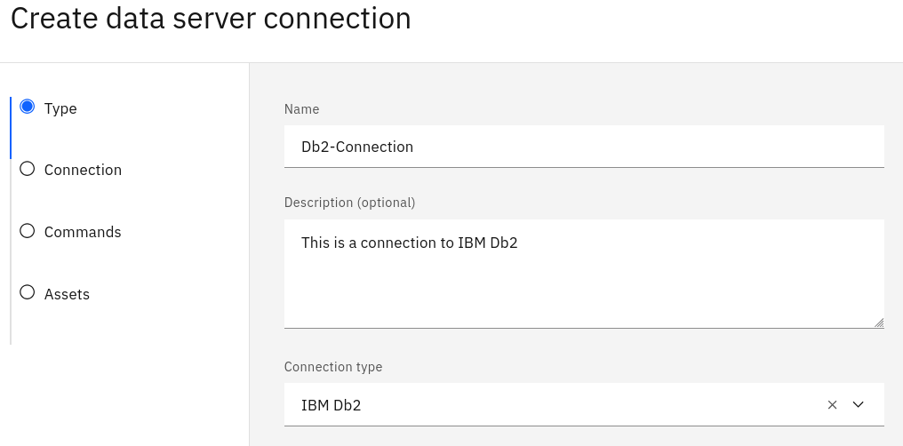
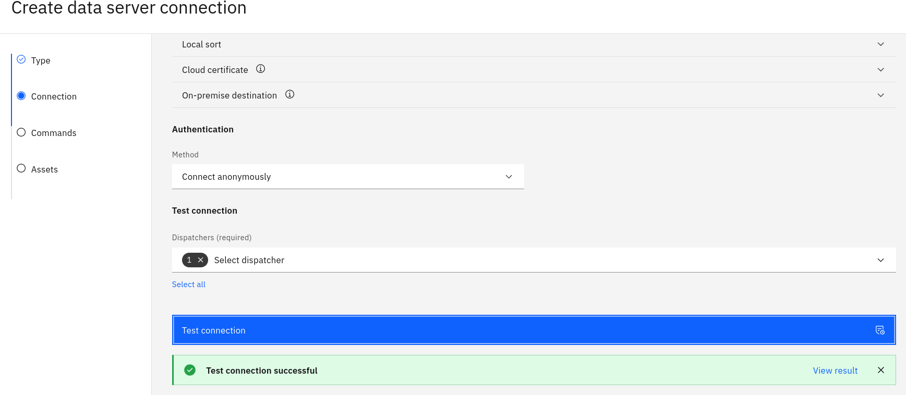
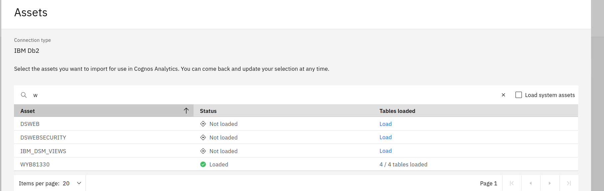
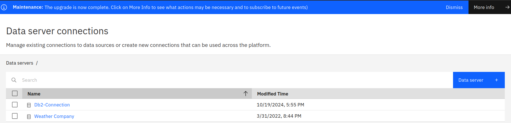
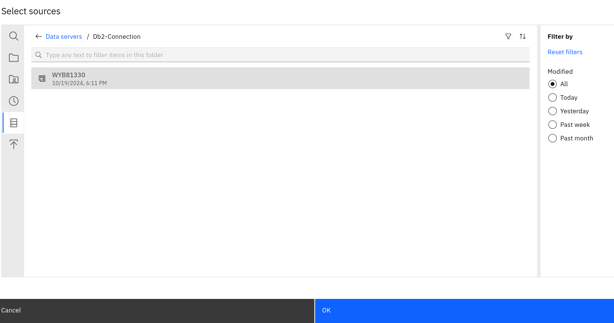

# Create a BI dashboard

Go to IBM->Lunch IBM Cognos Analytics->Manage->Data Server Connections

Fill the type of connection

Click Next to fill the connection details

Enter the jdbc url containing the host, port, username and password

Set Authentication method to "Connect Anonymously"

Select at list one dispatcher

Test connection

Select Create 

Check the name of the database schema and search it in Assets

Select the scham
Click LOad
Click Done

The connection is now created with the schama loaded

Create a data module
New-> Data Module-> Data SErvers and Schemas

Then select your connection and then the schama

Then Click ok

Click on Select tables
Check the schama and click ok

Ctrol S to save the data module
Name it  Sales in MyContent

Ten create a new Dashboard
